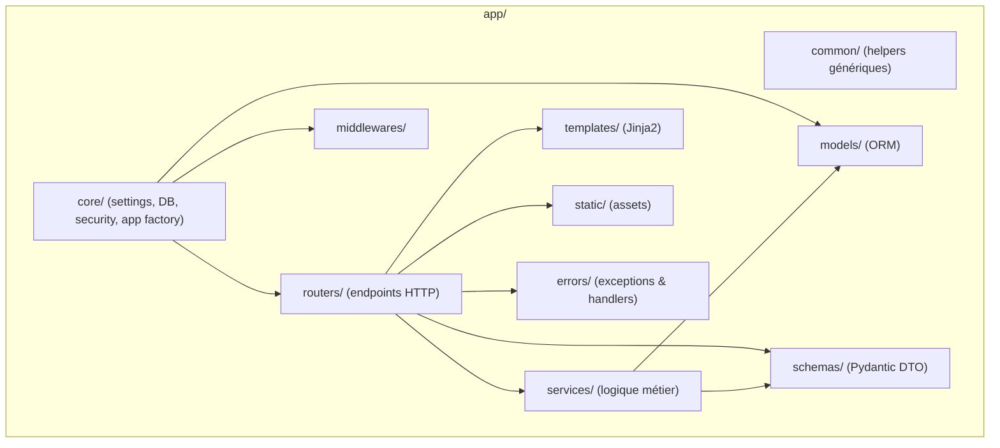

# 🧩 Architecture du projet

Ce projet utilise FastAPI et adopte une organisation modulaire visant à séparer clairement les responsabilités.
L’objectif : un code lisible, testable et facile à faire évoluer.

---

## 📁 Structure générale

```text
app/
│
├── common/          # Helpers transverses (non métier)
├── core/            # Infrastructure : settings, DB, app factory, sécurité
├── errors/          # Exceptions custom + handlers FastAPI
├── middlewares/     # Middlewares FastAPI/Starlette
├── models/          # Modèles ORM (SQLAlchemy)
├── routers/         # Endpoints HTTP (APIRouter)
├── schemas/         # Schémas Pydantic (I/O API)
├── services/        # Logique métier (indépendante d’HTTP)
├── static/          # Ressources statiques (CSS, JS, images, assets)
│   └── assets/
└── templates/       # Templates Jinja2 pour rendu HTML
    └── partials/

data/                # Données locales, fixtures, ressources diverses
doc/                 # Documentation technique
migrations/          # Migrations DB (Alembic)
tests/               # Tests unitaires, fonctionnels, intégration
main.py              # Point d’entrée FastAPI
Makefile             # Commandes utilitaires (dev, test, lint…)
pyproject.toml       # Config du projet (uv)
uv.lock              # Lockfile du projet
README.md            # Documentation principale
```

---

## 🧠 Rôle de chaque dossier

### `app/common/`

Fonctions génériques réutilisables dans toute l’application.  
Aucune logique métier.  
Exemples : gestion des dates, hashing, pagination, validateurs.

### `app/core/`

Composants centraux de l’infrastructure :

- configuration globale (Pydantic Settings)
- création de l'application FastAPI
- gestionnaire de base de données
- sécurité (hashing, JWT, permissions)
- configuration du logging

### `app/errors/`

Gestion des erreurs :

- exceptions personnalisées
- handlers FastAPI
- formats d’erreurs uniformisés

### `app/middlewares/`

Middlewares globaux :

- CORS
- logs des requêtes
- performance / timing
- correlation-id
- monitoring

### `app/models/`

Modèles SQLAlchemy définissant la structure et les relations de la base.

### `app/schemas/`

Schémas Pydantic utilisés pour :

- validation des entrées API
- sérialisation des réponses
- DTO internes

### `app/services/`

Logique métier pure.  
Orchestre les opérations : persistance, appels externes, règles métier.  
Indépendant de FastAPI et d’HTTP.

### `app/routers/`

Définition des endpoints via `APIRouter`.  
Responsabilités :

- mapping URL → fonction
- lecture/validation des données
- appel des services
- gestion des réponses HTTP

### `app/templates/`

Templates Jinja2 pour générer des pages HTML.

### `app/static/`

Fichiers statiques : CSS, JS, images, médias.

---

## 🗺️ Diagramme d’architecture (Mermaid)



---

## 🎯 Objectifs de cette architecture

- Séparer clairement HTTP, métier et persistance
- Faciliter les tests et l’évolution du projet
- Éviter l’architecture spaghetti
- Rendre le code plus modulaire
- Préparer le terrain pour des fonctionnalités avancées (workers, agents IA, events)

## Les dependances utilisées

_**Pydantic**_: Utilisé pour la validation des données et la sérialisation.

_**FastAPI**_: Framework web moderne et performant pour construire des APIs.

_**Annotated**_: Permet d'améliorer la lisibilité et la maintenabilité du code grâce aux annotations de type.

_**Python-dotenv**_: Charge les variables d'environnement à partir d'un fichier `.env`.

_**Watchfiles**_: Surveille les modifications de fichiers pour le rechargement automatique en développement.

_**Ruff**_: Outil de linting et de formatage pour maintenir la qualité du code.
